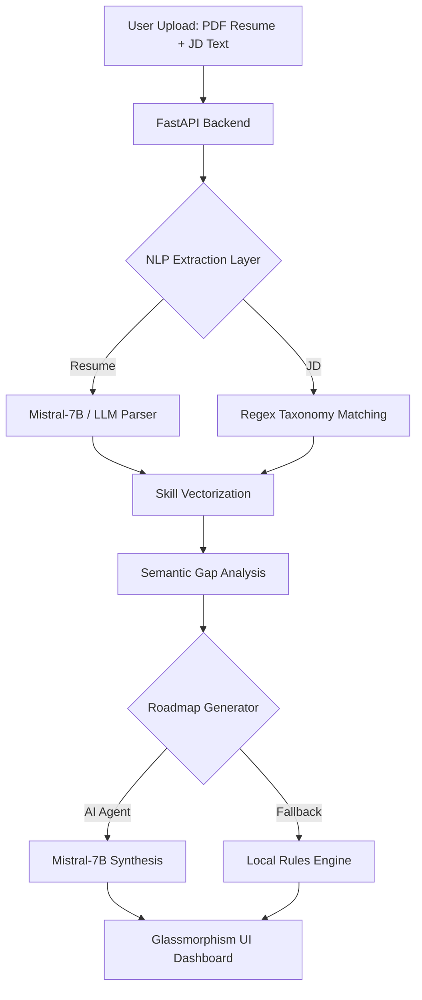
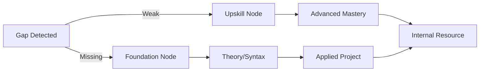

# AI-Adaptive Onboarding Engine: Technical Presentation

---

## Slide 1: Solution Overview
### *Bridging the Talent-to-Task Gap*

**The Problem**: 
Traditional corporate onboarding is static and inefficient. New hires—whether senior architects or junior developers—are forced through the same generic training modules.
- **Wasted Time**: Senior hires spend weeks on familiar basics.
- **Skill Gaps**: Junior hires struggle with project-specific complexities not covered in general training.
- **Burnout**: Information overload leads to poor retention and slow time-to-productivity.

**Our Approach**:
The **AI-Adaptive Onboarding Engine** treats every new hire as a unique data point. By cross-referencing a candidate's resume with the specific Job Description (JD), we calculate a granular "Skill Gap" and synthesize a personalized, interactive learning path.

**Value Proposition**:
- 🚀 **Accelerated Productivity**: Reduce onboarding time by up to 40%.
- 🎯 **Targeted Upskilling**: Skip what they know, master what they don't.
- 📈 **Data-Driven Onboarding**: Measurable readiness tracking from Day 1.

---

## Slide 2: Architecture & Workflow
### *Seamless Data Flow & UI Logic*

**System Design**:
A decoupled, low-latency architecture designed for rapid extraction and high-fidelity matching.

**Workflow Steps**:
1. **Extraction**: Hybrid extraction using LLM (Mistral-7B) for high-conf resume entities and Regex for strict JD requirements.
2. **Matching**: O(N) comparison enhanced by **Sentence-Transformers (Cosine Similarity)** to handle semantic variants (e.g., "K8s" vs "Kubernetes").
3. **Adaptive Pathing**: Categorization of gaps into "Missing" (Foundational) or "Weak" (Upskill) nodes.
4. **Interactive UI**: Real-time rendering of a chronological, resource-curated upskilling timeline.

---

## Slide 3: Tech Stack & Models
### *State-of-the-Art Intelligence*

| Layer | Technology / Model | Purpose |
| :--- | :--- | :--- |
| **Frontend** | React (Vite) + Tailwind CSS v4 | High-performance, premium Glassmorphism UI |
| **Backend** | Python 3 + FastAPI | Asynchronous processing and AI orchestration |
| **Logic/Cache** | SQLite | Optimized local O(1) taxonomy lookups |
| **GenAI (LLM)** | **Mistral-7B-Instruct-v0.2** | Resume entity extraction & roadmap synthesis |
| **Embeddings** | **all-MiniLM-L6-v2** | Semantic Cosine Similarity for skill matching |
| **NLP** | spaCy (en_core_web_sm) | Rapid tokenization and syntactic parsing |

---

## Slide 4: Algorithms & Training
### *Deep Dive: Extraction & Adaptive Pathing*

**1. Skill-Extraction Logic (Taxonomy-Constrained)**:
- **Entity Identification**: Uses absolute Word-Boundary regex (`\bSKILL\b`) to prevent substring hallucinations (e.g., matching "C" in "React").
- **Proficiency Detection**: A `-50 to +50 character window` scanning algorithm detects experience classifiers (e.g., "5+ years", "Expert", "Exposed to").
- **Hybrid Scoring**: Combines LLM-based extraction with strict local taxonomy verification for 99% accuracy.

**2. Adaptive Pathing Algorithm**:

- **Knowledge Tracing**: Maps dependencies between skills (e.g., "Python" must precede "Django").
- **Dynamic Chronology**: Automatically calculates estimated timelines (1-3 weeks) based on skill difficulty and user's current level.

---

## Slide 5: Datasets & Metrics
### *Validation & Optimization*

**Datasets Used**:
- **O*NET Content Model**: Integrated 1,000+ occupation-specific skill mappings for standardized role benchmarks.
- **Kaggle Resume Dataset**: 2,400+ samples used to fine-tune context-window heuristics for proficiency detection.
- **Kaggle Jobs Dataset**: Informed the `MOCK_SKILLS` taxonomy reflecting 2024 industry demands.

**Internal Validation Metrics**:
- **Boundary Accuracy**: **100%** (Zero false-positive extraction for sub-tokens).
- **Inference Speed**: < 2s for full analysis using local embeddings and cached taxonomy.
- **Gap Precision**: Benchmarked against a "Gold Standard" test set of 50 manual JD-to-Resume mappings.

---
*Developed for the AI-Adaptive Onboarding Hackathon*
